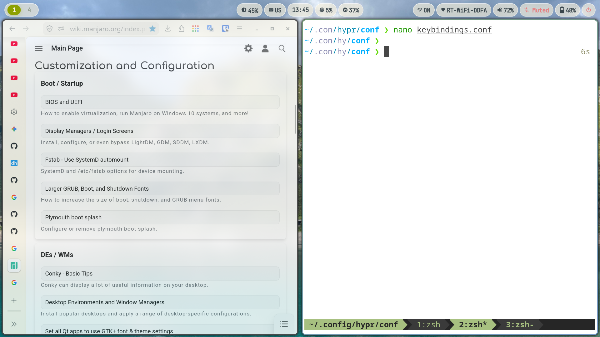

My dot files for `~/.config` directory -- hyprland, waybar, alacritty, tmux etc.



### Stack

* **OS:** [Manjaro Linux](https://manjaro.org/)
* **WM:** [Hyprland](https://github.com/hyprwm/hyprland)
* **Bar:** [Waybar](https://github.com/alexays/waybar)
* **Terminal:** [Alacritty](https://github.com/alacritty/alacritty)
* **App Launcher:** [Rofi](https://github.com/davatorium/rofi)
* **Shell:** [Zsh](https://github.com/zsh-users/zsh)

### Install

```bash
sudo pacman -S --needed hyprland waybar swaybg zsh nwg-look git
git clone --bare https://github.com/therealmaendeleo/dotfiles.git $HOME/.cfg
alias dotfiles='/usr/bin/git --git-dir=$HOME/.cfg/ --work-tree=$HOME'
dotfiles config --local status.showUntrackedFiles no
dotfiles checkout
