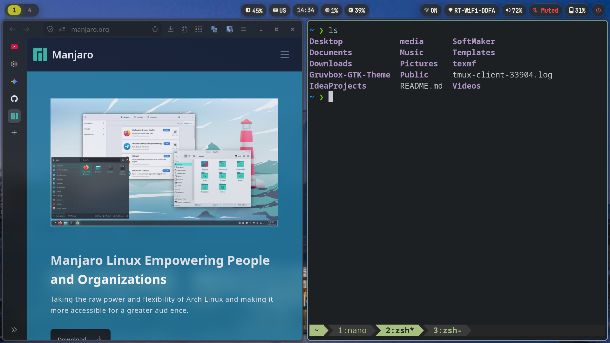
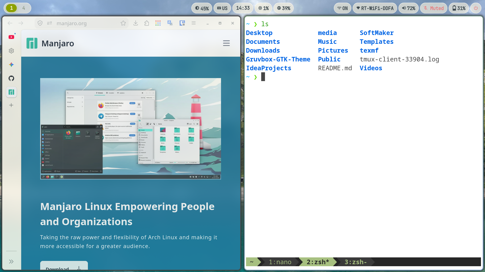

| Dark Mode (Gruvbox) | Light Mode (Everforest) |
| :---: | :---: |
|  |  |


### Stack

* **OS:** [Manjaro Linux](https://manjaro.org/)
* **WM:** [Hyprland](https://github.com/hyprwm/hyprland)
* **Bar:** [Waybar](https://github.com/alexays/waybar)
* **Terminal:** [Alacritty](https://github.com/alacritty/alacritty)
* **App Launcher:** [Rofi](https://github.com/davatorium/rofi)
* **Shell:** [Zsh](https://github.com/zsh-users/zsh)
* **Themes:** [Everforest-B-MB-Light](https://www.gnome-look.org/p/1695467) & [Gruvbox-B-MB-Dark](https://www.gnome-look.org/p/1681313/) (download from [GNOME Look](https://www.gnome-look.org/))

### Setup

1. Install dependencies

```bash
sudo pacman -S --needed \
  hyprland waybar swaybg hyprlock \
  alacritty tmux zsh rofi nautilus loupe \
  polkit-kde-agent network-manager-applet brightnessctl \
  wl-clipboard papirus-icon-theme ttf-nerd-fonts-symbols \
  nwg-look git wpctl
```

2. Clone dotfiles

```bash
git clone --bare https://github.com/therealmaendeleo/dotfiles.git $HOME/.cfg
alias dotfiles='/usr/bin/git --git-dir=$HOME/.cfg/ --work-tree=$HOME'
dotfiles config --local status.showUntrackedFiles no
dotfiles checkout
```

3. Install Themes

```bash
mkdir -p ~/.themes
tar -xf ~/Downloads/Gruvbox-B-MB-Dark.tar.xz -C ~/.themes/
tar -xf ~/Downloads/Everforest-B-MB-Light.tar.xz -C ~/.themes/
```